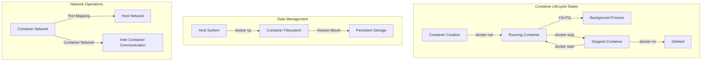

# 🐳 Docker Container Lifecycle Management
[](https://github.com/TheToriqul/docker-container-lifecycle)
[](https://www.docker.com/)
[](https://ubuntu.com/)
[](https://www.gnu.org/software/bash/)

## 📋 Overview
A comprehensive exploration of Docker container lifecycle management, demonstrating practical implementation of container operations from creation to deletion. This project serves as both a learning resource and reference implementation for DevOps engineers and developers working with containerization technologies. Currently actively maintained and updated with best practices.

## 🏗 Architecture


## 💻 Technical Stack
- **Container Runtime**: Docker Engine v24.0+
- **Base Image**: Ubuntu Latest
- **Shell**: Bash 5.0+
- **Documentation**: Markdown
- **Scripting**: Shell Scripts
- **Version Control**: Git

## ⭐ Key Features
1. Container Lifecycle Management
   - Container creation with customization
   - Interactive shell access
   - State management operations
   - Resource cleanup procedures

2. Data Operations
   - File system manipulation
   - Volume management
   - Data persistence verification
   - File transfer utilities

3. Process Management
   - Background process handling
   - Process monitoring
   - Resource usage tracking
   - State transition management

4. Networking
   - Port mapping
   - Network creation
   - Container networking
   - Network isolation

5. Resource Control
   - Memory limitations
   - CPU constraints
   - Storage management
   - Process limitations

6. Monitoring & Logging
   - Container stats
   - Log management
   - Event monitoring
   - Health checks

## 📚 Learning Journey
### Technical Mastery:
1. Docker Container Architecture
2. Container State Management
3. Resource Optimization
4. Networking Concepts
5. Storage Management
6. Security Best Practices
7. Performance Monitoring
8. Shell Scripting

### Professional Development:
1. DevOps Methodologies
2. System Administration
3. Documentation Skills
4. Problem-solving Strategies
5. Resource Planning

## 🔄 Future Enhancements
<details>
<summary>View Planned Improvements</summary>

1. Container orchestration examples
2. Advanced networking scenarios
3. Custom image building
4. Monitoring integration
5. Security hardening
6. Automated testing
7. CI/CD integration
8. Performance optimization
</details>

## ⚙️ Installation
<details>
<summary>View Installation Details</summary>

### Prerequisites
- Docker Engine installed
- Git for version control
- Basic command line knowledge
- Ubuntu base image pulled

### Setup Steps
1. Clone the repository:
   ```bash
   git clone https://github.com/TheToriqul/docker-container-lifecycle.git
   ```
2. Navigate to project directory:
   ```bash
   cd docker-container-lifecycle
   ```
3. Verify Docker installation:
   ```bash
   docker --version
   ```
4. Pull the Ubuntu image:
   ```bash
   docker pull ubuntu:latest
   ```
</details>

## 📖 Usage Guide
<details>
<summary>View Usage Details</summary>

### Basic Usage
- Create and manage containers
- Execute commands inside containers
- Manage container states
- Handle data persistence

### Advanced Features
- Network configuration
- Volume management
- Resource constraints
- Container monitoring

### Troubleshooting
- State verification
- Log analysis
- Network debugging
- Resource monitoring
</details>

## 🛠 Development
<details>
<summary>View Development Details</summary>

### Script Management
- Organize scripts by functionality
- Maintain consistent naming conventions
- Document all commands
- Version control integration

### Testing
- Manual testing procedures
- Command verification
- State transition testing
- Error handling verification
</details>

## 📝 Documentation

- Command Reference [(`scripts.sh`)](./script.sh)
- Architecture Guide [(`architecture.md`)](./architecture.md)
- Best Practices Guide [(`bestpractices.md`)](./bestpractices.md)
- Troubleshooting Guide [(`troubleshooting.md`)](./troubleshooting.md)
- Contributing Guidelines [(`contributing.md`)](./contributing.md)

## 📫 Contact
- 📧 Email: toriqul.int@gmail.com
- 📱 Phone: 
  - Singapore: +65 8936 7705
  - Bangladesh: +8801765 939006

## 🔗 Project Links
- [GitHub Repository](https://github.com/TheToriqul/docker-container-lifecycle)
- [Author GitHub](https://github.com/TheToriqul)

## 👏 Acknowledgments
- [Poridhi for for excellent labs](https://poridhi.io/)
- [Docker Community for excellent documentation](https://docs.docker.com/)
- Ubuntu Team for reliable base images
- Open Source Community for knowledge sharing
- Fellow developers for insights and feedback

---

Feel free to explore, modify, and build upon this configuration as part of my learning journey. You're also welcome to learn from it, and I wish you the best of luck!