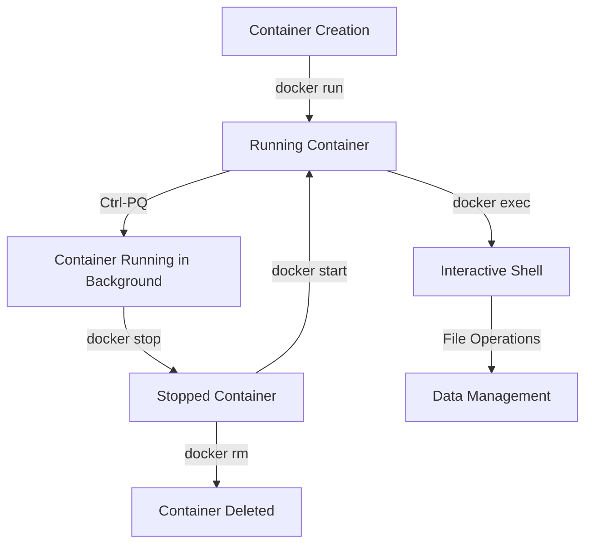

# 🐳 Docker Container Lifecycle Management
[](https://github.com/TheToriqul/docker-container-lifecycle)
[](https://www.docker.com/)
[](https://ubuntu.com/)

## 📋 Overview
This project demonstrates my practical understanding of Docker container lifecycle management, showcasing hands-on experience with container operations from creation to deletion. Through this implementation, I've developed practical skills in container management, data persistence, and Docker CLI operations, making it valuable for DevOps engineers and developers working with containerization.

## 🏗 Architecture


## 💻 Technical Stack
- **Container Runtime**: Docker Engine
- **Base Image**: Ubuntu Latest
- **Shell**: Bash
- **Documentation**: Markdown

## ⭐ Key Features
1. Container Management
   - Container creation with custom naming
   - Interactive shell access
   - Background process management
   - Container lifecycle control

2. Data Operations
   - File system manipulation
   - Data persistence verification
   - Directory navigation
   - File content management

3. State Management
   - Container state transitions
   - Process supervision
   - Status monitoring
   - Resource cleanup

4. CLI Operations
   - Docker command mastery
   - Container inspection
   - Process listing
   - Error handling

## 📚 Learning Journey
### Technical Mastery:
1. Docker Container Lifecycle States
2. Data Persistence in Containers
3. Container Process Management
4. Docker CLI Operations
5. Container Resource Management

### Professional Development:
1. DevOps Best Practices
2. System Administration
3. Documentation Skills
4. Troubleshooting Methodology
5. Resource Management

## 🔄 Future Enhancements
<details>
<summary>View Planned Improvements</summary>

1. Multi-container orchestration
2. Volume management implementation
3. Network configuration examples
4. Resource limitation demonstrations
5. Container health monitoring
6. Automated lifecycle scripts
</details>

## ⚙️ Installation
<details>
<summary>View Installation Details</summary>

### Prerequisites
- Docker Engine installed
- Basic command line knowledge
- Ubuntu base image

### Setup Steps
1. Clone the repository:
   ```bash
   git clone https://github.com/TheToriqul/docker-container-lifecycle.git
   ```
2. Navigate to project directory:
   ```bash
   cd docker-container-lifecycle
   ```
3. Ensure Docker is running:
   ```bash
   docker --version
   ```
</details>

## 📖 Usage Guide
<details>
<summary>View Usage Details</summary>

### Basic Usage
Follow the documented examples in the repository to understand:
- Container creation and naming
- Interactive shell access
- Data manipulation
- State management

### Advanced Features
- Container state transitions
- Data persistence verification
- Process management
- Resource cleanup

### Troubleshooting
- Common container issues
- State verification
- Data persistence problems
</details>

## 📝 Documentation

- [Poridhi Labs](https://poridhi.io/)
- [Docker Documentation](https://docs.docker.com/)

## 📫 Contact
- 📧 Email: toriqul.int@gmail.com
- 📱 Phone: 
  - Singapore: +65 8936 7705
  - Bangladesh: +8801765 939006

## 🔗 Project Links
- [GitHub Repository](https://github.com/TheToriqul/docker-container-lifecycle)

## 👏 Acknowledgments

I'd like to thank the Poridhi Labs and Docker communities for their extensive documentation and tutorials which greatly aided my learning process.

---

Feel free to explore, modify, and build upon this configuration as part of my learning journey. You're also welcome to learn from it, and I wish you the best of luck!