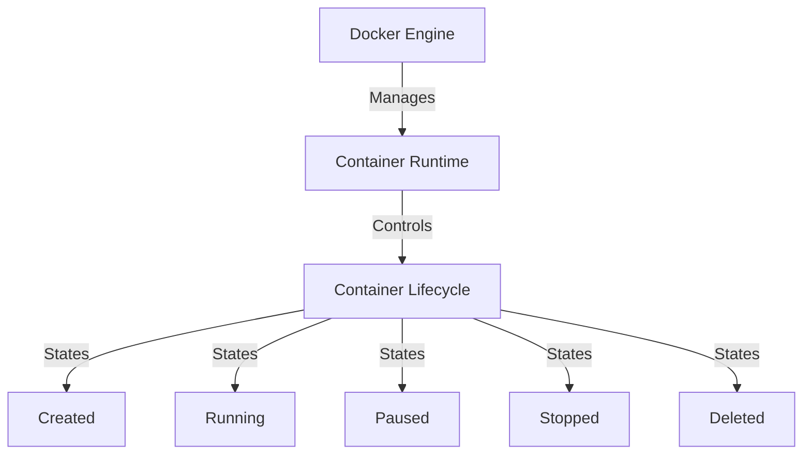
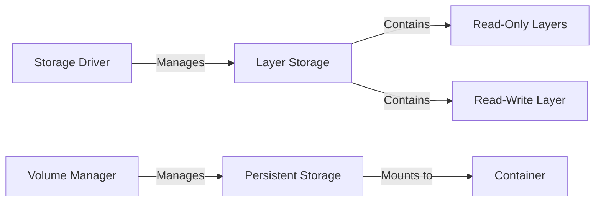
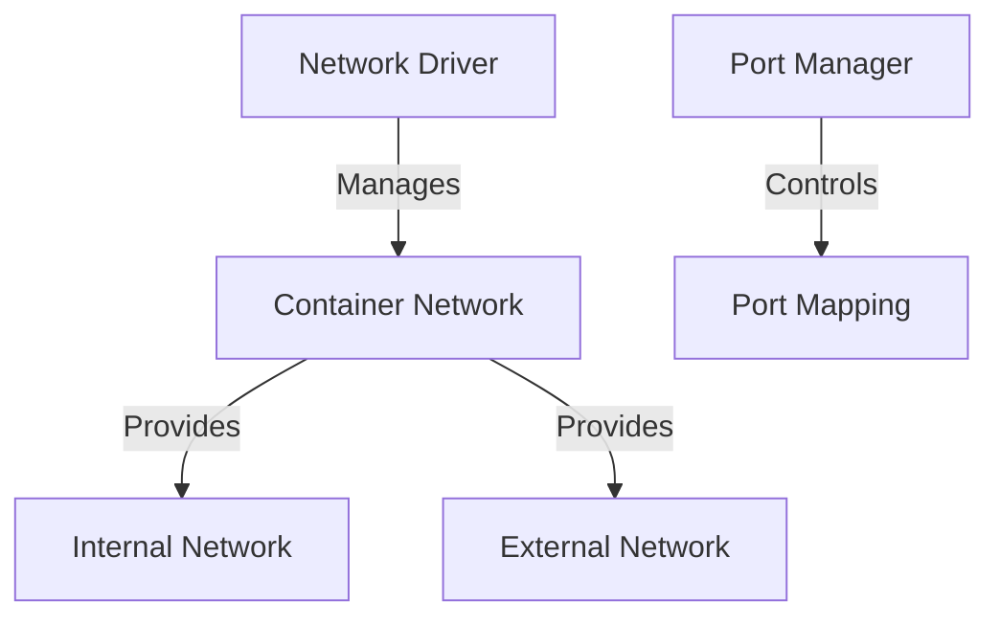
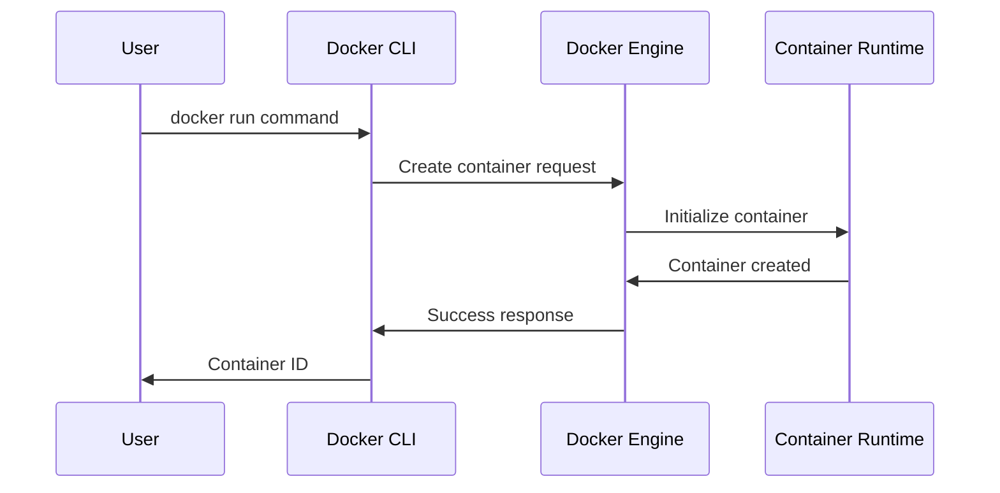
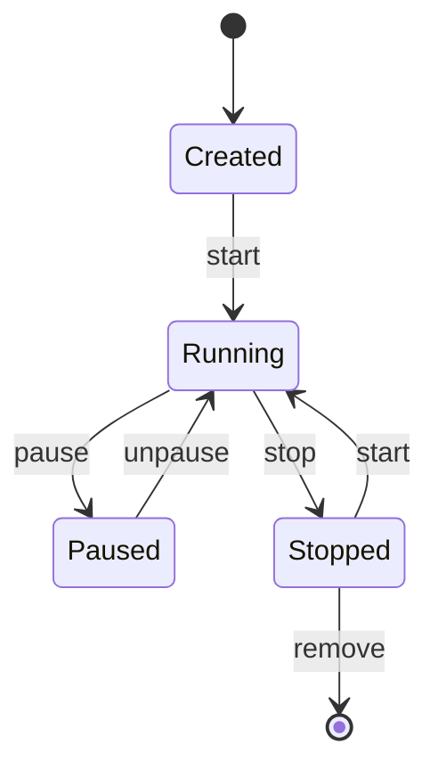

# Docker Container Lifecycle - Architecture Guide

## Overview
This document outlines the architectural design and components of the Docker container lifecycle management system.

## System Components

### 1. Container Runtime Layer

#### Key Components:
- **Docker Engine**: Core container management system
- **Container Runtime**: Execution environment
- **State Manager**: Handles container state transitions
- **Resource Controller**: Manages system resources

### 2. Storage Architecture

#### Storage Components:
- **Storage Driver**: Manages layered filesystem
- **Volume Manager**: Handles persistent storage
- **Layer Storage**: Container filesystem layers
- **Bind Mounts**: Host-container file sharing

### 3. Network Architecture

#### Network Components:
- **Network Driver**: Network connectivity
- **Port Manager**: Port mapping and exposure
- **DNS**: Name resolution
- **Network Isolation**: Container networking

## Data Flow

### 1. Container Creation Flow

### 2. State Transition Flow

## Resource Management

### 1. Memory Management
- Container memory limits
- Swap configuration
- OOM handling
- Memory monitoring

### 2. CPU Management
- CPU share allocation
- CPU pinning
- Resource constraints
- Performance monitoring

### 3. Storage Management
- Layer storage
- Volume management
- Temp storage
- Cache management

## Security Architecture

### 1. Container Isolation
- Namespace isolation
- Resource isolation
- Network isolation
- Process isolation

### 2. Access Control
- Permission management
- Capability control
- Security contexts
- Resource restrictions

## Monitoring Architecture

### 1. Metrics Collection
- Resource usage
- Performance metrics
- State changes
- Events logging

### 2. Logging System
- Container logs
- Engine logs
- Event logs
- Audit logging

## Best Practices Implementation

### 1. Resource Optimization
- Proper resource allocation
- Efficient state management
- Optimized networking
- Storage efficiency

### 2. Security Measures
- Regular updates
- Security scanning
- Access control
- Network security

## System Requirements

### 1. Hardware Requirements
- Minimum CPU: 2 cores
- Minimum RAM: 4GB
- Storage: 20GB+
- Network: 1Gbps

### 2. Software Requirements
- Docker Engine 24.0+
- Ubuntu 20.04+
- Bash 5.0+
- Git 2.0+